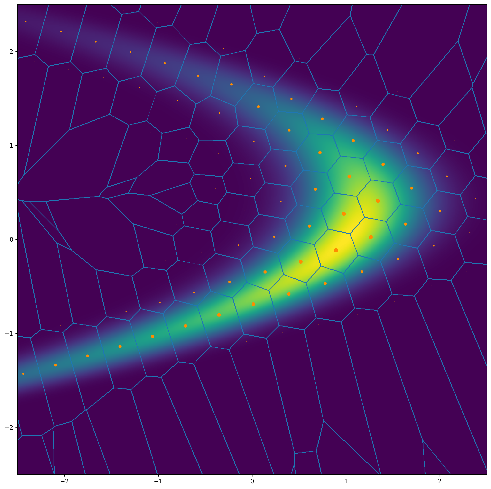

# Coding Playground

The playground provides useful tools to train and evaluate your codecs on toy sources!

* visualize the quantization centers and boundaries of your codecs
* compare with different anchor codecs, including the optimal entropy-constrained vector quantization.

Todo List:
* [x] Basic training framework.
* [x] R-D results of VQ/ECVQ, NT-VQ/NT-ECVQ and NTC, in [result/](result) directory.
* [ ] Tutorial to build your own models and toy distributions.
* [ ] The visualization of latent-space quantization results.

## Installation
We recommend using [miniconda](https://docs.conda.io/en/latest/miniconda.html) for installation.

```bash
python -m pip install -r requirements.txt
pip install -e .
```

## Usage
Our training framework and command line interface are based on [PyTorch Lightning](https://github.com/Lightning-AI/pytorch-lightning).

The example command lines can be found in [script/](script) directory.
To train ECVQ on Boomerang distribution, run:

```bash
bash script/vector2d/boomerang_ecvq.sh
```

The visualization and tensorboard results can be found in [log/](log) directory.
For more detailed usage, see tutorial (TODO).

In the figure below, we show the quantization results of ECVQ on the Boomerang distribution. 
The blue lines represent the quantization boundaries, and the orange points denote the quantization centers. 
The size of the orange points reflects the probability associated with each quantization center, with larger points corresponding to higher probabilities.
